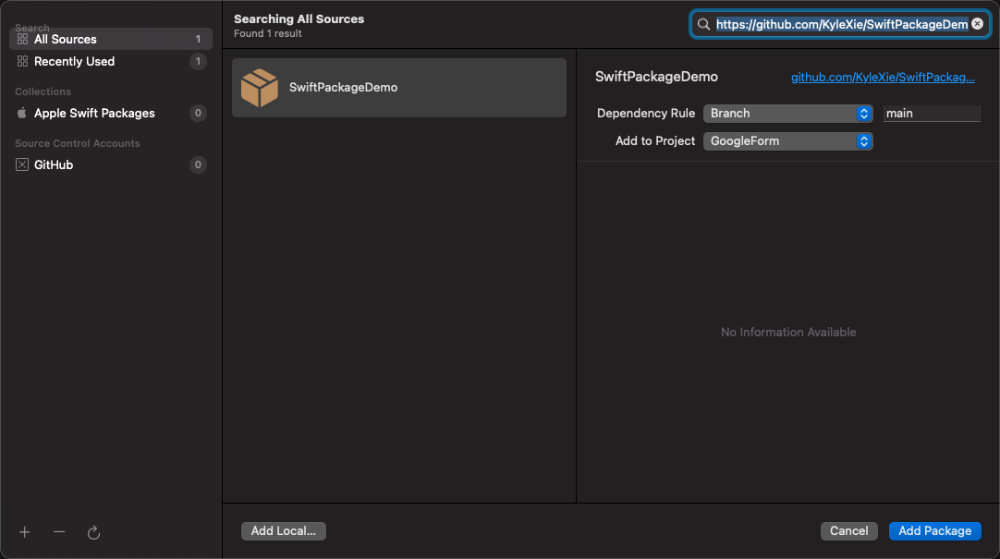

# ZujuAppSync

This repo shows us how to create a swift package.

## 1. Create a swift package project
In your Xcode, create a new project, and choose `Swift Package` template.

Give it a name, for example, `ZujuAppSync`.

Xcode will generate the basic folders for you, something like this:

## 2. Add dependencies
Open the `Package` file, and add dependencies.

You just need to edit the package dependencies part, all the other parts are generated by Xcode. In this case, we added `AWSAppSync` as an example.

## 3. Add sources
Add all the source code(and other files if needed) to the `Sources` folder. All the files in this folder will be included in the package.

## 4. Push the package to a GitHub repo

For example [https://github.com/KyleXie/SwiftPackageDemo.git](https://github.com/KyleXie/SwiftPackageDemo.git)

It's also better to add a new release and give it a tag(version number), so we can ref it when importing the package.

## 5. How to use it

In a new iOS project, on the package dependencies page, click on the `+` button at the bottom.

Copy the GitHub link to the search field, and you could see the package we just built:

Click on `Add Package` button, the package will be added to the new iOS project.
